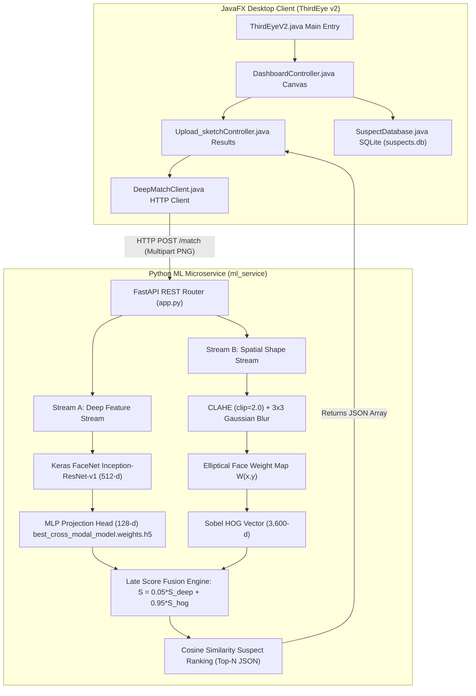
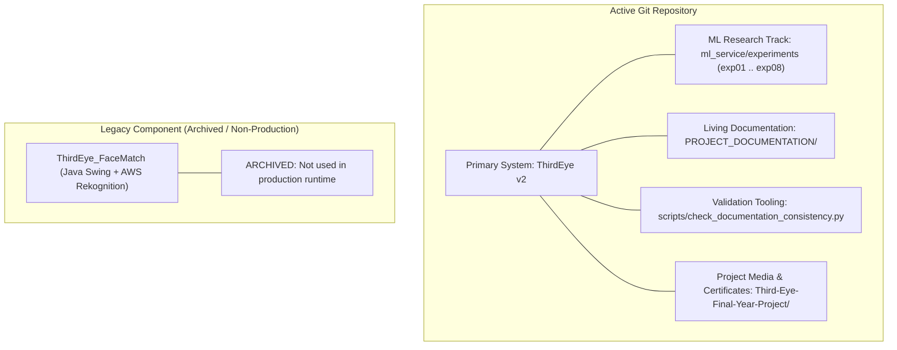

# CANONICAL COMPONENT ARCHITECTURE & REPOSITORY TOPOLOGY

---

## 1. Primary Production Architecture (ThirdEye v2)

```mermaid
graph TD
    subgraph Client ["JavaFX Desktop Client (ThirdEye v2)"]
        UI["ThirdEyeV2.java Main Entry"] --> DB_CTRL["DashboardController.java Canvas"]
        DB_CTRL --> MATCH_CTRL["Upload_sketchController.java Results"]
        MATCH_CTRL --> NET["DeepMatchClient.java HTTP Client"]
        DB_CTRL --> SQL_LOCAL["SuspectDatabase.java SQLite (suspects.db)"]
    end

    subgraph Service ["Python ML Microservice (ml_service)"]
        NET -->|"HTTP POST /match (Multipart PNG)"| FASTAPI["FastAPI REST Router (app.py)"]
        FASTAPI --> EMB_STREAM["Stream A: Deep Feature Stream"]
        FASTAPI --> HOG_STREAM["Stream B: Spatial Shape Stream"]

        EMB_STREAM --> FACENET["Keras FaceNet Inception-ResNet-v1 (512-d)"]
        FACENET --> PROJ_HEAD["MLP Projection Head (128-d) best_cross_modal_model.weights.h5"]

        HOG_STREAM --> CLAHE["CLAHE (clip=2.0) + 3x3 Gaussian Blur"]
        CLAHE --> HOG_MASK["Elliptical Face Weight Map W(x,y)"]
        HOG_MASK --> HOG_VEC["Sobel HOG Vector (3,600-d)"]

        PROJ_HEAD --> FUSION["Late Score Fusion Engine: S = 0.05*S_deep + 0.95*S_hog"]
        HOG_VEC --> FUSION

        FUSION --> RANKING["Cosine Similarity Suspect Ranking (Top-N JSON)"]
        RANKING -->|"Returns JSON Array"| MATCH_CTRL
    end
```

---

## 2. Supporting Experiments & Legacy Components Topology

```mermaid
graph TD
    subgraph ActiveRepo ["Active Git Repository"]
        PROD["Primary System: ThirdEye v2"]
        PROD --- EXP["ML Research Track: ml_service/experiments (exp01 .. exp08)"]
        PROD --- DOCS["Living Documentation: PROJECT_DOCUMENTATION/"]
        PROD --- TOOLS["Validation Tooling: scripts/check_documentation_consistency.py"]
        PROD --- MEDIA["Project Media & Certificates: Third-Eye-Final-Year-Project/"]
    end

    subgraph LegacyArchive ["Legacy Component (Archived / Non-Production)"]
        LEGACY["ThirdEye_FaceMatch (Java Swing + AWS Rekognition)"]
        LEGACY --- NOTICE["ARCHIVED: Not used in production runtime"]
    end
```
